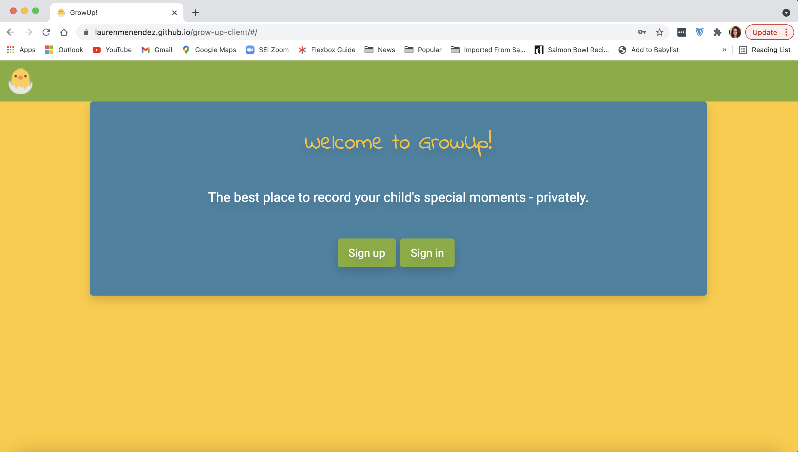

# GrowUp!

## About
GrowUp! is an application that allows parents to digitally document their children privately. Parents can create profiles for each of their children and add features for each child, such as milestones, to memorialize their child's achievements.

## Links
### Back-end repository
https://github.com/laurenmenendez/grow-up
### Deployed Client
https://laurenmenendez.github.io/grow-up-client
### Deployed API
https://grow-up2021.herokuapp.com

## Technologies
- React.js
- Node.js
- JavaScript
- Bootstrap
- Sass

## User Stories
### MVP
As an unregistered user, I would like to sign up with email and password.
As a registered user, I would like to sign in with email and password.
As a signed in user, I would like to change password.
As a signed in user, I would like to sign out.
As a signed in user, I would like to create a child
As a signed in user, I would like to update my child
As a signed in user, I would like to delete a child
As a signed in user, I would like to see all my children
As a signed in user, I would like to add milestones to my child
As a signed in user, I would like to edit milestones to my child
As a signed in user, I would like to delete milestones to my child
As a signed in user, I would like to see all milestones for one child

### v2
As a signed in user, I would like to add, edit, and delete quotes for my child
As a signed in user, I would like to add and delete photos of my child
As a signed in user, I would like to organize milestones, quotes, and photos by category or date for my child

### v3 & beyond
As a signed in user, I would like to share my child with another user
As a signed in user, I would like to export my child to a PDF/JPG "scrapbook"

## Wireframes

## Planning
### Process
- I decided on building the front-end in React and the back-end in Django from the start. So, I built the back-end first in a way I know would be optimal with how I planned to build in React (i.e. how I would render all of a child's milestones.) This helped me avoid needing to continuously refactor my backend.
- I leveraged the code in the react-auth-template and my group's project 3 React app as my base, and improved and expanded upon it. I was able to solve a few UX bugs that were present in our previous project.
- When problem solving, I made heavy use of the internet. I learned a lot from reading through React and Bootstrap documentation, as well as combing through Stack Overflow threads. I submitted an issue request to GA instructors as well.

### Future versions
- More sophisticated design (animations, transitions)
- Utilize more react-bootstrap Components
- Add nav links (FAQ, About Us, Contact Us)
- Create logo
- Refactor UX based on future expansion of API
